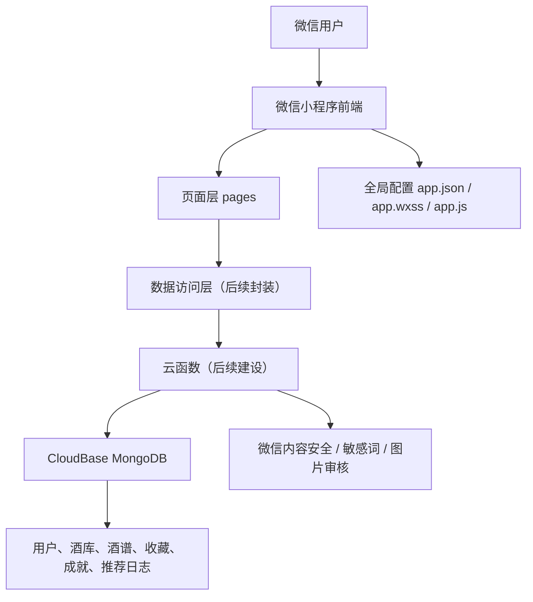
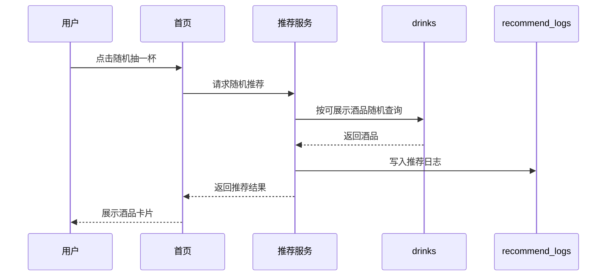
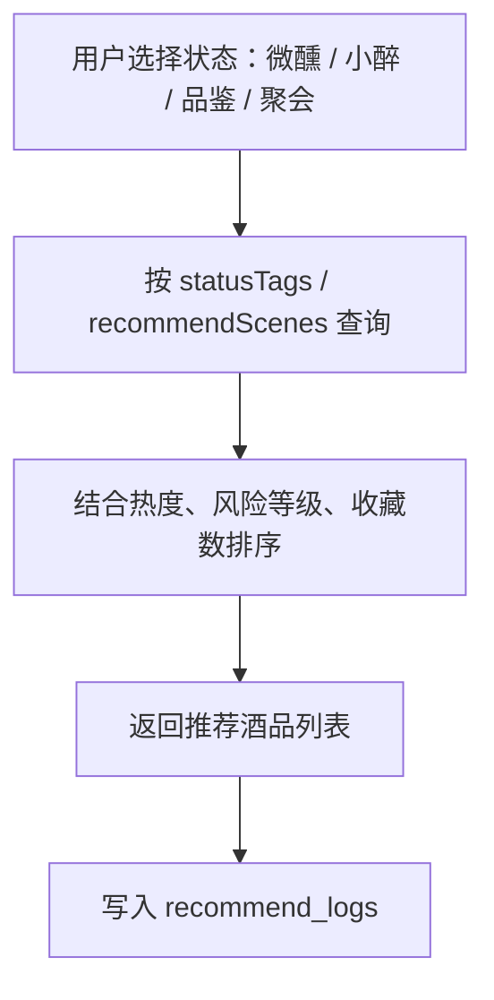
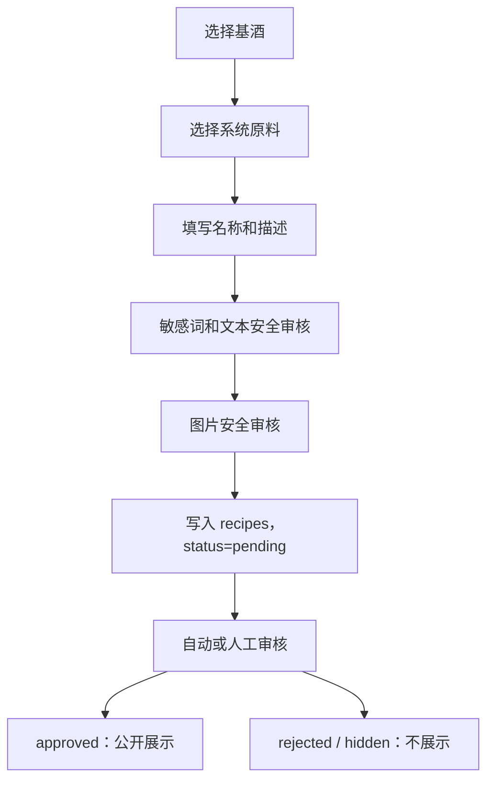
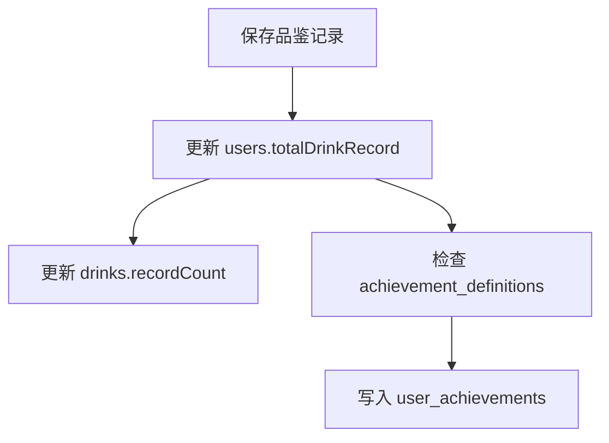

# Drink One 技术体系架构

版本：v1.0  
项目类型：微信小程序  
当前阶段：原生小程序静态 MVP + CloudBase 数据模型设计

---

## 1. 项目定位

Drink One（喝一杯）是一个酒类推荐与记录类微信小程序。产品不做酒类销售，核心目标是帮助用户快速决定“今晚喝什么”，并围绕酒文化探索、DIY 酒谱、品鉴记录、收藏和成就形成轻量闭环。

产品边界：

- 提供酒类信息展示、推荐和记录。
- 不提供酒类购买、交易、配送能力。
- 不鼓励酗酒、拼酒、挑战饮酒或危险配方。
- 所有 UGC 酒谱内容需要经过审核后展示。

---

## 2. 总体架构



当前代码主要集中在小程序前端。数据层已经在 `Database Design.md` 中完成集合设计，后续需要补云开发初始化、云函数和数据访问封装。

---

## 3. 技术栈

| 层级 | 技术 | 说明 |
| --- | --- | --- |
| 小程序端 | 微信原生小程序 | 使用 `.wxml`、`.wxss`、`.js`、`.json` 页面结构 |
| UI 样式 | 原生 WXSS | 全局基础组件样式在 `app.wxss` |
| 路由配置 | `app.json` | 注册页面、窗口样式、底部 tabBar |
| 数据库 | 微信云开发 CloudBase MongoDB | 规划中的主数据存储 |
| 后端逻辑 | 云函数 | 后续承载登录、推荐、审核、点赞收藏、成就解锁 |
| 测试校验 | Node.js 脚本 | `tests/validate-miniprogram.js` 校验页面结构 |

---

## 4. 当前目录结构

```text
.
├── app.js
├── app.json
├── app.wxss
├── sitemap.json
├── project.config.json
├── project.private.config.json
├── package.json
├── PRD v1.0.md
├── Database Design.md
├── docs/
│   └── technical-architecture.md
├── tests/
│   └── validate-miniprogram.js
└── pages/
    ├── index/
    ├── mood/
    ├── detail/
    ├── diy/
    ├── ranking/
    ├── library/
    ├── test/
    ├── achievements/
    ├── profile/
    └── record/
```

页面文件遵循微信小程序标准结构：

```text
pages/<page-name>/
├── <page-name>.js
├── <page-name>.json
├── <page-name>.wxml
└── <page-name>.wxss
```

---

## 5. 页面模块

### 5.1 主 tab 页面

| 页面 | 路径 | 职责 |
| --- | --- | --- |
| 首页 | `pages/index/index` | 今日推荐、状态入口、随机抽酒、安全提示 |
| 酒库 | `pages/library/library` | 酒品分类、搜索、列表浏览 |
| DIY 酒谱 | `pages/diy/diy` | 创建酒谱流程入口，选择基酒与配料 |
| 排行榜 | `pages/ranking/ranking` | 热门榜、微醺榜、创意榜、收藏榜 |
| 我的 | `pages/profile/profile` | 用户信息、统计、菜单入口 |

### 5.2 二级页面

| 页面 | 路径 | 职责 |
| --- | --- | --- |
| 状态推荐 | `pages/mood/mood` | 根据“微醺、小醉、品鉴、聚会”等状态推荐酒品 |
| 酒品详情 | `pages/detail/detail` | 酒品基础信息、标签、场景、风险提示、记录入口 |
| 酒量测试 | `pages/test/test` | 用户填写基础信息，后续生成酒量等级参考 |
| 成就系统 | `pages/achievements/achievements` | 展示已解锁和未解锁成就 |
| 品鉴记录 | `pages/record/record` | 评分、饮用感受、饮用场景记录 |

---

## 6. 前端分层建议

当前页面仍以静态数据为主。进入真实数据开发后，建议逐步形成以下分层：

```text
miniprogram
├── pages/              页面展示和交互
├── components/         可复用 UI 组件
├── services/           云函数和数据库访问封装
├── models/             数据类型和字段约定
├── utils/              日期、格式化、安全提示等工具
└── constants/          枚举、页面路径、业务常量
```

推荐优先抽取的组件：

- `drink-card`：酒品卡片，用于首页、酒库、状态推荐。
- `bottle-visual`：当前用 CSS 模拟酒瓶，后续可替换真实图片。
- `safe-notice`：理性饮酒提示。
- `ranking-item`：排行榜条目。
- `achievement-card`：成就卡片。
- `tag-list`：口感、状态、场景标签。

---

## 7. 数据架构

数据库采用 CloudBase MongoDB。核心集合按业务域分为五类。

### 7.1 用户域

| 集合 | 用途 |
| --- | --- |
| `users` | 用户基础信息、探索等级、累计记录数、成就数量 |
| `drink_records` | 用户品鉴记录 |
| `user_favorites` | 用户收藏的酒品 |
| `user_achievements` | 用户已解锁成就 |

### 7.2 酒品域

| 集合 | 用途 |
| --- | --- |
| `drink_categories` | 酒品分类，如啤酒、红酒、威士忌 |
| `drinks` | 酒品库核心数据 |
| `drink_tags` | 状态、口感、场景、风格标签 |

### 7.3 DIY 酒谱域

| 集合 | 用途 |
| --- | --- |
| `ingredients` | 系统允许选择的原料库 |
| `recipes` | 用户创建的酒谱 |
| `recipe_likes` | 酒谱点赞关系 |
| `recipe_favorites` | 酒谱收藏关系 |

重要约束：

- `ingredients` 是安全边界，用户不能自由输入危险原料。
- `recipes.status` 控制酒谱展示状态：`pending`、`approved`、`rejected`、`hidden`。
- `recipe_likes` 需要 `recipeId + userId` 联合唯一索引，避免重复点赞。

### 7.4 推荐与榜单域

| 集合 | 用途 |
| --- | --- |
| `recommend_logs` | 记录推荐行为，支持后续个性化和数据分析 |
| `drinks.favoriteCount` | 酒品收藏榜依据 |
| `drinks.recordCount` | 品鉴榜依据 |
| `recipes.likeCount` | 酒谱热门榜依据 |
| `recipes.favoriteCount` | 酒谱收藏榜依据 |

### 7.5 系统与审核域

| 集合 | 用途 |
| --- | --- |
| `system_configs` | 安全提示、运营配置 |
| `report_records` | 举报和人工审核记录 |

---

## 8. 核心业务流程

### 8.1 随机抽酒



### 8.2 状态推荐



推荐策略初期可以简单实现：

- 微醺：低酒精度、低风险、口感轻盈。
- 品鉴：信息完整、标签丰富、评分较高。
- 聚会：容量适合分享、热度高。
- 小醉：中低风险，仍需展示安全提示。

### 8.3 DIY 酒谱发布



安全规则：

- 禁止药物混酒。
- 禁止危险配方。
- 禁止拼酒、断片、挑战类表达。
- 禁止未成年人饮酒内容。
- 审核不通过直接隐藏。

### 8.4 品鉴记录与成就



成就系统原则是鼓励探索，不鼓励饮酒量。建议按“记录不同酒品数量”“发布酒谱”“获得点赞”解锁，不按饮酒频次或酒精摄入量解锁。

---

## 9. 云函数规划

后续建议按业务能力拆分云函数，避免一个大函数承载所有逻辑。

| 云函数 | 职责 |
| --- | --- |
| `login` | 获取 openid，创建或更新用户 |
| `getHomeData` | 首页今日推荐、安全提示、热门酒谱 |
| `getRandomDrink` | 随机抽酒并写入推荐日志 |
| `getMoodRecommendations` | 状态推荐 |
| `getDrinkDetail` | 酒品详情和浏览计数 |
| `toggleDrinkFavorite` | 酒品收藏/取消收藏 |
| `saveDrinkRecord` | 保存品鉴记录，触发成就检查 |
| `createRecipe` | 创建 DIY 酒谱，进入审核流 |
| `toggleRecipeLike` | 酒谱点赞/取消点赞 |
| `toggleRecipeFavorite` | 酒谱收藏/取消收藏 |
| `getRanking` | 榜单查询 |
| `reportContent` | 举报内容 |
| `checkAchievements` | 统一成就解锁逻辑 |

---

## 10. 权限与安全

### 10.1 用户身份

- 使用微信云开发获取 `openid`。
- 前端不应信任传入的 `userId`，涉及用户身份的写操作应在云函数中用 `openid` 解析。
- 用户资料只保存业务必要字段。

### 10.2 数据写入

所有写操作建议通过云函数完成：

- 点赞、收藏需要防重复。
- 品鉴记录需要校验评分范围 `1~5`。
- DIY 酒谱必须校验 `baseDrinkId` 和 `ingredientIds` 是否存在且可用。
- UGC 内容必须先审核再公开。

### 10.3 内容审核

审核顺序建议：

1. 本地敏感词规则初筛。
2. 微信文本内容安全接口。
3. 微信图片安全接口。
4. 举报后人工处理。

---

## 11. UI 与设计系统

当前视觉基于效果图实现，主要设计变量集中在 `app.wxss`。

基础风格：

- 背景：浅灰白 `#F7F8FC`。
- 主色：紫色 `#6B4CFF`。
- 强调色：橙色、红色、绿色用于标签和酒瓶状态。
- 卡片：白底、轻边框、柔和阴影。
- 圆角：卡片约 `16rpx~20rpx`，按钮约 `18rpx`。

当前已沉淀的全局类：

- `.page`
- `.page-with-tab`
- `.card`
- `.soft-card`
- `.section-title`
- `.tag`
- `.pill`
- `.primary-button`
- `.search`
- `.bottle`

后续维护原则：

- 公共样式优先沉淀到 `app.wxss`。
- 页面私有布局留在页面自己的 `.wxss`。
- 真实酒瓶图片接入前，`.bottle` 可作为占位视觉。
- 不要在多个页面重复写同一套卡片、标签、按钮样式。

---

## 12. 测试与校验

当前提供了一个轻量结构测试：

```bash
npm.cmd test
```

测试文件：

```text
tests/validate-miniprogram.js
```

当前校验内容：

- `app.json` 是否注册所有核心页面。
- 每个页面的 `.js`、`.json`、`.wxml`、`.wxss` 是否存在。
- `tabBar` 是否包含五个主页面。
- 关键首页文案是否存在。
- 所有页面 JSON 是否能被解析。
- DIY 页面是否暴露 `steps` 和 `baseDrinks` 数据。

后续可以增加：

- 页面路径和跳转 URL 一致性检查。
- 云函数入参校验测试。
- 推荐算法单元测试。
- 成就解锁规则测试。
- 内容审核规则测试。

---

## 13. 后续开发路线

### 阶段一：前端静态页面完善

- 继续还原效果图细节。
- 抽取公共组件。
- 补充真实图片资源。
- 优化小程序模拟器适配。

### 阶段二：云开发基础设施

- 开启 CloudBase 环境。
- 添加 `envId` 配置。
- 建立数据库集合和索引。
- 初始化分类、标签、原料、成就数据。

### 阶段三：核心数据闭环

- 登录和用户创建。
- 酒库列表和详情真实查询。
- 随机推荐和状态推荐。
- 收藏、记录、推荐日志。

### 阶段四：UGC 与审核

- DIY 酒谱创建。
- 文本和图片安全审核。
- 酒谱发布状态流转。
- 点赞、收藏、举报。

### 阶段五：增长与体验

- 榜单真实排序。
- 成就系统自动解锁。
- 个性化推荐。
- 浏览记录。
- 运营配置后台或管理脚本。

---

## 14. 开发注意事项

- 涉及酒精内容时，默认加入理性饮酒提示。
- 不要设计鼓励大量饮酒、拼酒、断片的功能或文案。
- DIY 酒谱不能让用户自由填写原料，只能从系统原料库选择。
- 前端展示状态不能替代后端审核，安全规则必须放在云函数侧再校验。
- 排行榜和成就要奖励探索、收藏、创作，不奖励饮酒量。
- 所有新增页面必须同步更新 `app.json` 和结构测试。

